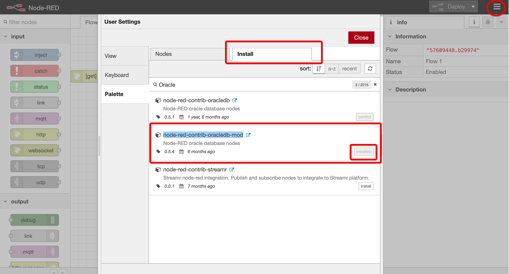
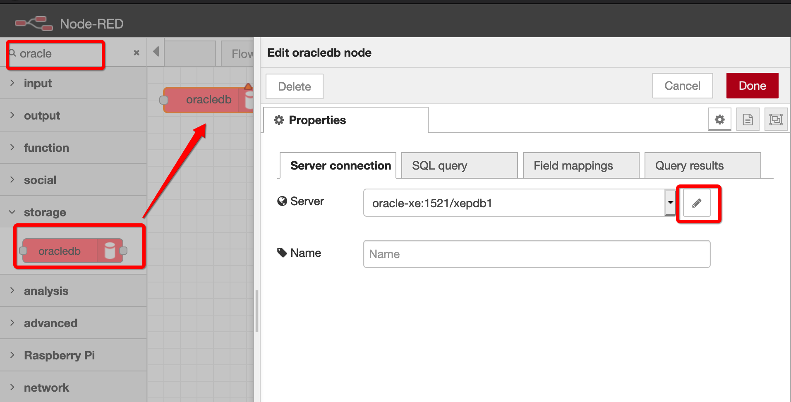
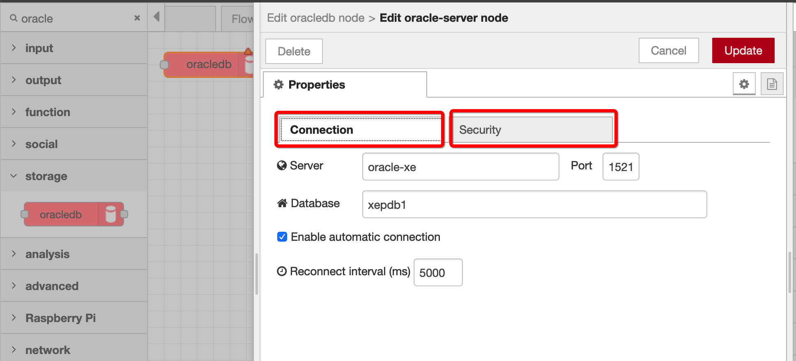
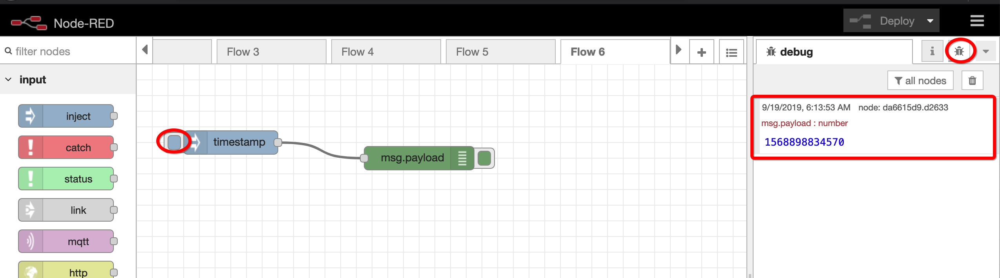
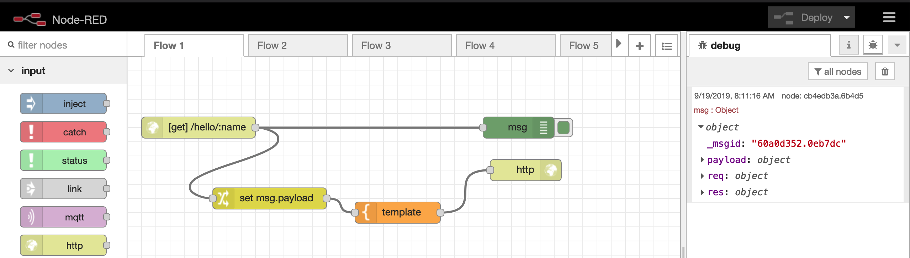
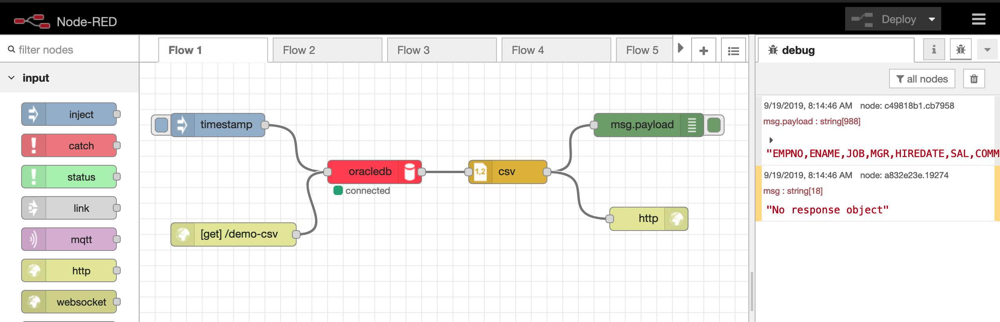
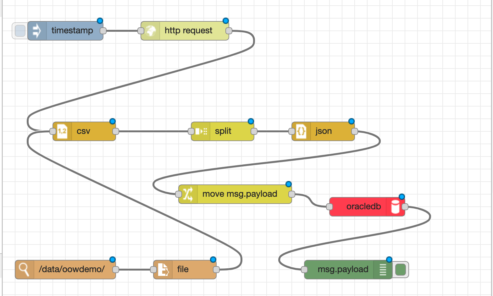
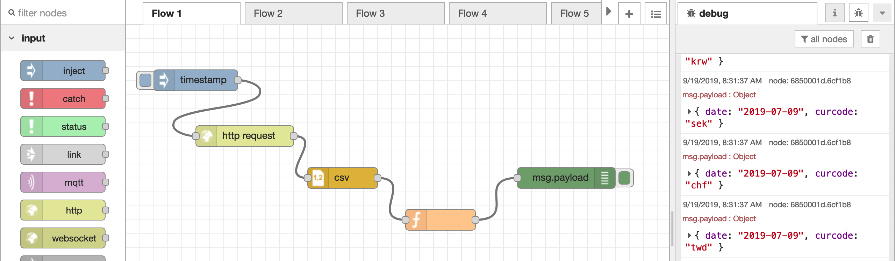
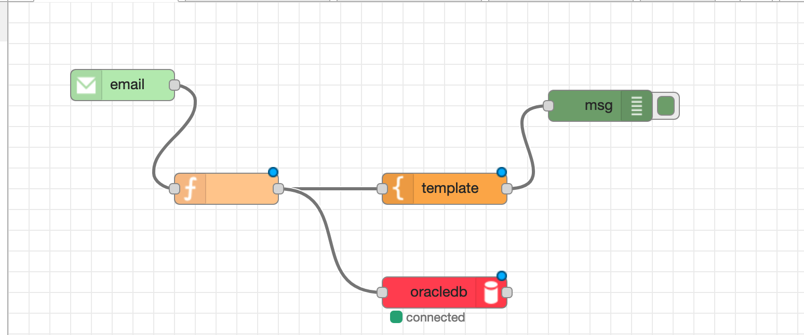
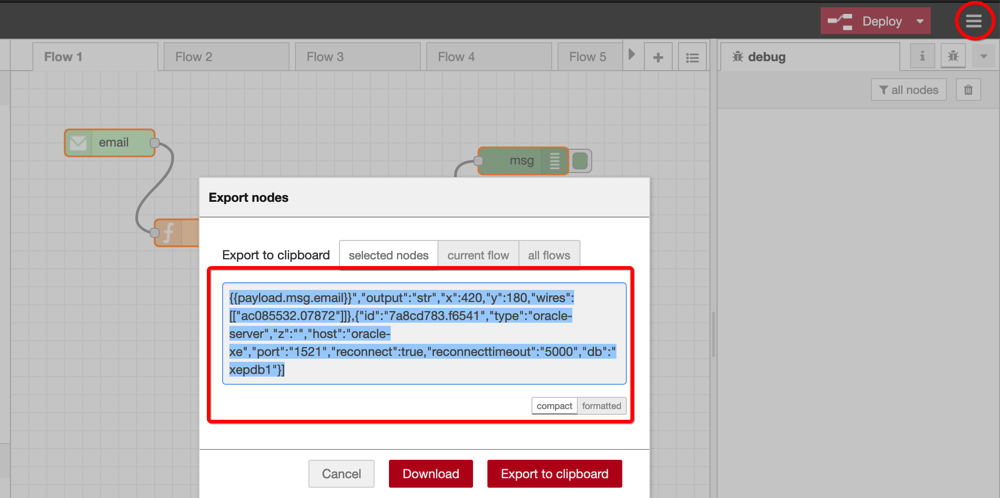

# Node-RED Demo


While going over the demo try to remember the goal: **Think Different!**

Are a Problem / Solution model

- [Prep:](#prep)
- [Demo 0 Node-RED Setup](#demo-0-node-red-setup)
  - [Add Oracle Node](#add-oracle-node)
  - [Configure Oracle Node](#configure-oracle-node)
- [Demo 1: Start / Debug](#demo-1-start--debug)
- [Demo 2: Create a RESTful Service](#demo-2-create-a-restful-service)
- [Demo 3: Generate CSV from query](#demo-3-generate-csv-from-query)
- [Demo 4: Track file changes](#demo-4-track-file-changes)
- [Demo 5: Custom Functions](#demo-5-custom-functions)
- [Demo 6: Monitor / read emails](#demo-6-monitor--read-emails)
- [Demo 7: Import / Export](#demo-7-import--export)


## Prep:

See [demo-prep.md](demp-prep.md)

## Demo 0 Node-RED Setup

Introduction to NodeRed


```bash
ssh opc@ocidockerdev.talkapex.com

# Note: See slides for launching Node-RED. This is a common Docker run command
docker run -it -d \
  -p 9980:1880 \
  -v node-red:/data \
  --name nodered \
  --network=oracle_network \
  martindsouza/node-red-oracle

# Talk about port forwarding with Tunnel
```

Go to: http://localhost:9980

### Add Oracle Node

- Menu (_Top right corner_)
- Manage palette
- Install
  - Search for `Oracle`
  - Chose `node-red-contrib-oracledb-mod`




### Configure Oracle Node




Note: If using the Docker container The networking configuration will be relative to your container's instance which may be different than your laptops network.


Server: `oracle-xe`
Database: `oracle-xe`
Port: `1521`


## Demo 1: Start / Debug

- Node: Inject
- Node: debug



[demo1.json](demo1.json)

## Demo 2: Create a RESTful Service

Want to create a quick RESTful web service to say "hello world"

- Node: http
  - GET: `/hello`
- Node: Template:
  - `Hello OOW`
- Node: http response
- http://localhost:9980/hello


Advanced: Pass in a URL parameter

- Node: http
  - Get: `/hello/:name`
- Add Node: Debug
  - Set to all `msg` 
- http://localhost:9980/hello/martin
  - Look at debug and look at `req/params`
- Add Node: Change
  - Set `msg.payload`
  - to: `msg.req.params`
- Modify Node: Template
  - `Hello OOW {{payload.name}}`
- http://localhost:9980/hello/martin


** Note: We'll come back to more of this terminology soon **



[demo2.json](demo2.json)


## Demo 3: Generate CSV from query

Want to generate a CSV file of a query via a URL

_Note: Can do in ORDS as well, but think about who's doing it._


** Step 1: ** Setup the query

- Node: Timestamp
- Node: Oracle
  - Query: `select * from emp`
  - Field Mappinhs: `null`
  - Results: `Single result message`
- Node: Debug


Demo


** Step 2: ** Add CSV

- Node: CSV
  - Columns: `EMPNO,ENAME,JOB,MGR,HIREDATE,SAL,COMM,DEPTNO`
  - Output: `Include Column Name Row`


Demo


** Step 3: ** Add HTTP

- Node: http
  - Prefix at start
  - URL: `/demo-csv`
- Node: HTTP Response
  - Suffix at end
  - Headers
    - `Content Type`: `text/csv`
    - `content-disposition` : `attachment; filename="emp.csv"`
- Demo: http://localhost:9980/demo-csv




[demo3.json](demo3.json)


## Demo 4: Track file changes

This can happen when people to bulk dumps of files on a file system

Source: https://github.com/TheEconomist/big-mac-data/tree/master/output-data

Queries to track changes in the databse:
```sql
truncate table big_mac_index;

select count(1)
from big_mac_index;
```


```bash
# Login to laptop
# In my Oracle Cloud setup I need to be root to access /var/lib....
sudo -i

# On laptop "/var/lib/docker/volumes/node-red/_data" maps to "/data" on Docker container
cd /var/lib/docker/volumes/node-red/_data
mkdir oowdemo

# Download CSV file
# Src: https://github.com/TheEconomist/big-mac-data/tree/master/output-data
cd /tmp
wget -O bmi.csv https://raw.githubusercontent.com/TheEconomist/big-mac-data/master/output-data/big-mac-adjusted-index.csv

# Copy file over to start
cd /var/lib/docker/volumes/node-red/_data/oowdemo
cp /tmp/bmi.csv .
```

**Step1: ** Read the file

- Node: Timestamp
- Node: Read file: `/data/oowdemo/bmi.csv`
- Node: Debug

**Step 2: ** Convert to CSV and insert into DB

- Node: CSV
  - Columns: `date,iso_a3,currency_code,name,local_price,dollar_ex,dollar_price,GDP_dollar,adj_price,USD,EUR,GBP,JPY,CNY`
  - First row contains header: Check
- Node: Oracle
  - Field Mappings: `["date","iso_a3","currency_code","name","local_price","dollar_ex","dollar_price","GDP_dollar","adj_price","USD","EUR","GBP","JPY","CNY"]`
  - Results: `Ignore Results`
  - SQL: 

```sql
insert into big_mac_index(
  bmi_date,
  iso_a3,
  currency_code,
  name,
  local_price,
  dollar_ex,
  dollar_price,
  gdp_dollar,
  adj_price,
  usd,
  eur,
  gbp,
  jpy,
  cny
)
values(
  to_date(:valueOfValuesArrayIndex0, 'YYYY-MM-DD'),
  :valueOfValuesArrayIndex1,
  :valueOfValuesArrayIndex2,
  :valueOfValuesArrayIndex3,
  :valueOfValuesArrayIndex4,
  :valueOfValuesArrayIndex5,
  :valueOfValuesArrayIndex6,
  :valueOfValuesArrayIndex7,
  :valueOfValuesArrayIndex8,
  :valueOfValuesArrayIndex9,
  :valueOfValuesArrayIndex10,
  :valueOfValuesArrayIndex11,
  :valueOfValuesArrayIndex12,
  :valueOfValuesArrayIndex13
)
```

- SQL: `truncate table big_mac_index;`

** Step 3: ** Solve 500 Solution

- Node CSV: Change to one array message
- Node: Split: `20`
- Node: JSON: 
- Node: Change
  - `move` : `msg.payload`
    - `msg.payload.data`
- Node: Oracle
  - Field Mappings: `[ "data" ]`
  - SQL: 
  
```sql
insert into big_mac_index(
  bmi_date,
  iso_a3,
  currency_code,
  name,
  local_price,
  dollar_ex,
  dollar_price,
  gdp_dollar,
  adj_price,
  usd,
  eur,
  gbp,
  jpy,
  cny
)
select 
  to_date(bmi_date, 'YYYY-MM-DD') bmi_date,
  iso_a3,
  currency_code,
  name,
  local_price,
  dollar_ex,
  dollar_price,
  gdp_dollar,
  adj_price,
  usd,
  eur,
  gbp,
  jpy,
  cny
from json_table(:valueOfValuesArrayIndex0, '$[*]'
  columns(
    bmi_date varchar2(255) path '$.date',
    iso_a3 varchar2(255) path '$.iso_a3',
    currency_code varchar2(255) path '$.currency_code',
    name varchar2(255) path '$.name',
    local_price number path '$.local_price',
    dollar_ex number path '$.dollar_ex',
    dollar_price number path '$.dollar_price',
    gdp_dollar number path '$.GDP_dollar',
    adj_price number path '$.adj_price',
    usd number path '$.USD',
    eur number path '$.EUR',
    gbp number path '$.GBP',
    jpy number path '$.JPY',
    cny number path '$.CNY'
  )
)
```


- SQL: `truncate table big_mac_index;`


** Step 4: ** Drop file


```bash
# Clear the test data
rm -rf /data/oowdemo/bmi.csv
```

- Node: Watch: `/data/oowdemo/`
- Node: File (modify)
  - Filename: `<blank>`
- Disconnect Oracle and debug JSON to test:

```bash
# sudo -i 

cp /tmp/bmi.csv /var/lib/docker/volumes/node-red/_data/oowdemo
```


- SQL: `truncate table big_mac_index;`
- Reconnect Oracle
`cp /tmp/bmi.csv /var/lib/docker/volumes/node-red/_data/oowdemo`


**Step 5: HTTP Request **

- Node: Watch - Disconnect
- Node: Http Request
  - Attach to Timeer
  - GET: `https://raw.githubusercontent.com/TheEconomist/big-mac-data/master/output-data/big-mac-adjusted-index.csv`
  - Attach to CSV

- SQL: `truncate table big_mac_index;`




[demo4.json](demo4.json)


## Demo 5: Custom Functions

Want to add a bit of programming to massage the data.

Using same data as before want to only get date and lower currency code.


- Node: Timer
- Node: http request
  - GET: `https://raw.githubusercontent.com/TheEconomist/big-mac-data/master/output-data/big-mac-adjusted-index.csv
- Node: CSV
  - Columns: `date,iso_a3,currency_code,name,local_price,dollar_ex,dollar_price,GDP_dollar,adj_price,USD,EUR,GBP,JPY,CNY`
  - First row contains header: `check`
- Node: Function
  
```javascript
let tmp = {};

tmp.date = msg.payload.date
tmp.curcode = msg.payload.currency_code.toLowerCase();

msg.payload = tmp;

return msg;
```




[demo5.json](demo5.json)

## Demo 6: Monitor / read emails

Want to read emails

_Note: I'll be using a gmail account to demo this functionality. If you use Gmail you'll have to enable Gmail API for your account / make it less secure._


```sql
truncate table email;

select *
from email;
```


** Step 1: ** 

- Node: Email
  - Getmail Every: `5`
  - Userid: `03j.dsouza@gmail.com`
  - pass: xyz
- Node: Debug
  - All Message object


** Step 2: ** Parse message

- Node: Function

```js
let tmp = {};

tmp.msg = msg.payload;
tmp.subject = msg.topic;
tmp.from = msg.header.from.value[0].address;

msg.payload = tmp;

return msg;

```

- Node: Debug
  - Just set to `msg.payload`


** Step 3: ** Insert to table

- Node Oracle
  - Field Mappings: ["msg","subject","from"]
  - Results: Ignore
  - Query: 

```sql
insert into email (
  msg, 
  subject, 
  from_address
)
values (
  :valueOfValuesArrayIndex0, 
  :valueOfValuesArrayIndex1, 
  :valueOfValuesArrayIndex2
)
```




[demo6.json](demo6.json)


## Demo 7: Import / Export

This shows how to share Flows:


- Menu > Import > Clipboard (could be a file)
- Menu > Export > Clipboard 

All the demos above have links at the bottom for the exported JSON structure.



